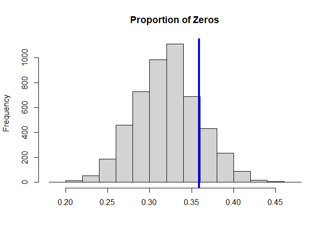

# STAR: Simultaneous Transformation and Rounding for Modeling Integer-Valued Data

## Background: integer-valued data

Integer-valued or count data are common in many fields. Frequently,
integer-valued data are observed jointly with predictors, over time
intervals, or across spatial locations. Integer-valued data also exhibit
a variety of distributional features, including zero-inflation,
skewness, over- and underdispersion, and in some cases may be bounded or
censored. Flexible and interpretable models for *integer-valued
processes* are therefore highly useful in practice.

As an illustration, consider the `roaches` data from Gelman and Hill
(2006). The response variable, $y_i$, is the number of roaches caught in
traps in apartment $i$, with $i=1,\ldots, n = 262$.

``` r
# Source: http://mc-stan.org/rstanarm/articles/count.html
data(roaches) 

# Roaches:
y = roaches$y

# Function to plot the point mass function:
stickplot = function(y, ...){
  js = 0:max(y); 
  plot(js, 
       sapply(js, function(js) mean(js == y)), 
       type='h', lwd=2, ...)
}
stickplot(y, main = 'PMF: Roaches Data',
          xlab = 'Roaches', ylab = 'Probability mass')
```

<!-- -->

There are several notable features in the data:

1.  Zero-inflation: 36% of the observations are zeros.
2.  (Right-) Skewness, which is clear from the histogram and common for
    (zero-inflated) count data.
3.  Overdispersion: the sample mean is 26 and the sample variance is
    2585.

A pest management treatment was applied to a subset of 158 apartments,
with the remaining 104 apartments receiving a control. Additional data
are available on the pre-treatment number of roaches, whether the
apartment building is restricted to elderly residents, and the number of
days for which the traps were exposed. We are interested in modeling how
the roach incidence varies with these predictors.

There are two main modeling frameworks for this kind of data:

1.  *Poisson and extensions*: the Poisson distribution is a valid
    count-valued distribution, and may incorporate predictions within a
    generalized linear modeling (GLM) framework. However, the Poisson
    distribution has limited modeling flexibility, which restricts
    practical utility in many applications. Extensions such as the
    zero-inflated Poisson, the negative-binomial, and the Conway-Maxwell
    distribuiton seek to enhance flexibility by adding parameters. While
    successful in some cases, these approaches require estimation of
    each additional parameter, which presents challenges especially in
    the presence of predictors or other (temporal or spatial)
    dependence.

2.  *Transformed Gaussian*: in applied settings, it is perhaps more
    common to simply ignore the discrete nature of the data and apply
    continuous data models. For example, one might consider the
    transformed regression model

$$
z_i = \log(y_i + 1), \quad
y_i = x_i'\beta + \epsilon_i, \quad \epsilon_i \stackrel{iid}{\sim}N(0, \sigma^2)
$$ The transformation helps model the skewness often found in count
data, while the regression model incorporates a simple and well-known
continuous data model. However, this approach has two major flaws: (i)
the transformation $z_i = \log(y_i + 1)$ requires the inclusion of an
artificial constant to accommodate $y_i=0$, which is arbitrary and may
introduce bias, and more importantly (ii) the implied data-generating
process is *not* integer-valued, which induces a fundamental discrepancy
between the data and the model.

## Simultaneous Transformation and Rounding (STAR) Models

STAR models build upon the continuous data model to provide a *valid
integer-valued data-generating process*. An example STAR model for
linear regression is as follows: The latent data $y_i^*$ act as a
*continuous proxy* for the count data $y_i$, which is easier to model
yet has a simple mapping via the floor function to the observed data.
The latent data $y_i^*$ are transformed to $z_i^*$, as in common
practice, and modeled using Gaussian linear regression. This model
inherits the same structure as before, but the data-generating process
is now integer-valued.

More generally, STAR models are defined via a *rounding operator* $h$, a
(known or unknown) *transformation* $g$, and a *continuous data model*
$\Pi_\theta$ with unknown parameters $\theta$: Importantly, STAR models
are highly flexible integer-valued processes, and provide the capability
to model (i) discrete data, (ii) zero-inflation, (iii) over- or
under-dispersion, and (iv) bounded or censored data.

We focus on conditionally Gaussian models of the form $$
z^*(x) = \mu_\theta(x) + \epsilon(x), \quad \epsilon(x) \stackrel{iid}{\sim}N(0, \sigma^2)
$$ where $\mu_\theta(x)$ is the conditional expectation of the
transformed latent data with unknown parameters $\theta$. Examples
include linear, additive, and tree-based regression models.

Estimation, inference, and prediction for STAR are available for both
*Bayesian* and *frequentist* models. Implementation in both cases is
provided in the `rSTAR` package.

## Frequentist inference for STAR models

Frequentist (or classical) estimation and inference for STAR models is
provided by an EM algorithm. Sufficient for estimation is an `estimator`
function which solves the least squares (or Gaussian maximum likelihood)
problem associated with $\mu_\theta$—or in other words, the estimator
that *would* be used for Gaussian or continuous data. Specifically,
`estimator` inputs data and outputs a list with two elements: the
estimated `coefficients` $\hat \theta$ and the `fitted.values`
$\hat \mu_\theta(x_i) = \mu_{\hat \theta}(x_i)$. The EM algorithm
updates the parameters until convergence to the maximum likelihood
estimators (MLEs), and is implemented in `star_EM`:

``` r
# Select a transformation:
transformation = 'log' # Log transformation
# transformation = 'np' # Estimated transformation using empirical CDF

# EM algorithm for STAR (using the log-link)
fit_em = lm_star(y ~ roach1 + treatment + senior + log(exposure2),
                 data = roaches, transformation = transformation)


# Dimensions:
n = nrow(fit_em$X); p = ncol(fit_em$X)

# Fitted coefficients:
round(coef(fit_em), 3)
```

    ##    (Intercept)         roach1      treatment         senior log(exposure2) 
    ##          1.260          0.015         -0.715         -0.912          0.560

Here the `log` transformation was used, but other options are available;
see `?lm_star` for details.

Based on the fitted STAR model, we may further obtain *confidence
intervals* for the estimated coefficients using `confint`:

``` r
# Confidence interval for the j=2 column:
j = 2
ci_j = confint(fit_em, level = 0.95,
        j = j,
        include_plot = FALSE)
print(round(ci_j, 3))
```

    ## [1] 0.012 0.019

``` r
# Confidence for all columns:
ci_all = sapply(1:p, function(j)
  confint(fit_em, level = 0.95,
        j = j,
        include_plot = FALSE))
colnames(ci_all) = colnames(fit_em$X); 
rownames(ci_all) = c('Lower', 'Upper')
print(t(round(ci_all, 3)))
```

    ##                 Lower  Upper
    ## (Intercept)     0.792  1.728
    ## roach1          0.012  0.019
    ## treatment      -1.262 -0.176
    ## senior         -1.526 -0.312
    ## log(exposure2) -0.557  1.700

Similarly, *p-values* are available using likelihood ratio tests, which
can be applied for individual coefficients,

$$
H_0: \beta_j= 0 \quad \mbox{vs} \quad H_1: \beta_j \ne 0
$$

or for joint sets of variables, analogous to a (partial) F-test:

$$
H_0: \beta_1=\ldots=\beta_p = 0, \quad \mbox{vs.} \quad H_1: \beta_j \ne 0 \mbox{ for some } j=1,\ldots,p
$$

``` r
# p-value for *any* effects
# Note that the null model estimator *does not* include any X:
# P-values:
print(pvals(fit_em))
```

    ##        (Intercept)             roach1          treatment             senior 
    ##       1.705446e-06       2.980645e-16       1.027886e-02       3.090894e-03 
    ##     log(exposure2) Any linear effects 
    ##       3.263339e-01       1.078662e-17

## Bayesian inference for STAR models

For a Bayesian model, STAR requires only an algorithm for *initializing
and sampling* from the posterior distribution under a *continuous data
model*. More specifically, posterior inference under STAR is based on a
Gibbs sampler, which augments the aforementioned continuous sampler with
a draw from $[z^* | y, \theta]$. When $\Pi_\theta$ is conditionally
Gaussian, $[z^* | y, \theta]$ is a truncated Gaussian distribution.

As an illustration, consider the Bayesian linear regression model With
STAR and a log transformation, posterior samples for
$(\beta, \sigma_\beta, \sigma)$ are obtained using `star_MCMC` as
follows:

``` r
X = model.matrix(y ~ roach1 + treatment + senior + log(exposure2),
                 data = roaches)

# Dimensions:
n = nrow(X); p = ncol(X)

fit_mcmc = star_MCMC(y = y,
                          sample_params = function(y, params)
                            sample_params_lm(y, X, params),
                         init_params = function(y) 
                           init_params_lm(y,X),
                         transformation = 'log', verbose = FALSE)
```

The function `sample_params` computes a single draw of the parameters
`params` conditional on continuous data. Here, the update is for
Bayesian linear Gaussian regression, which samples from the posterior of
$(\beta, \sigma_\beta, \sigma)$ conditional on the continuous latent
data $z^*$. The function `init_params` simply initializes the parameters
`params`. Posterior expectations and posterior credible intervals are
available as follows:

``` r
# Posterior mean of each coefficient:
round(coef(fit_mcmc),3)
```

    ##       beta1       beta2       beta3       beta4       beta5 sigma_beta1 
    ##       1.126       0.015      -0.597      -0.744       0.337    1000.000 
    ## sigma_beta2 sigma_beta3 sigma_beta4 sigma_beta5 
    ##       0.915       0.915       0.915       0.915

``` r
# Credible intervals for regression coefficients
ci_all_bayes = apply(fit_mcmc$post.coefficients[,1:p],
      2, function(x) quantile(x, c(.025, .975)))

# Rename and print:
colnames(ci_all_bayes) = colnames(X); rownames(ci_all_bayes) = c('Lower', 'Upper')
print(t(round(ci_all_bayes, 3)))
```

    ##                 Lower  Upper
    ## (Intercept)     0.580  1.632
    ## roach1          0.012  0.019
    ## treatment      -1.154 -0.043
    ## senior         -1.396 -0.085
    ## log(exposure2) -0.497  1.327

We may further evaluate the model based on posterior diagnostics and
posterior predictive checks on the simulated versus observed proportion
of zeros:

``` r
# Posterior draws of the regression coefficients:
post.coef = fit_mcmc$post.coefficients[,2:p]
colnames(post.coef) = colnames(X)[2:p]

# MCMC diagnostics:
plot(as.ts(post.coef), main = 'Trace plots', cex.lab = .75)
```

<!-- -->

``` r
# (Summary of) effective sample sizes across coefficients:
getEffSize(post.coef)
```

    ##    Min. 1st Qu.  Median    Mean 3rd Qu.    Max. 
    ##    2981    3404    4100    3987    4682    4767

``` r
# Posterior predictive check:
hist(apply(fit_mcmc$post.pred, 1,
           function(x) mean(x==0)), main = 'Proportion of Zeros', xlab='');
abline(v = mean(y==0), lwd=4, col ='blue')
```

<!-- -->

## Additional features in `rSTAR`

- A fixed upper bound, `y_max`, with $y(x) \le \mbox{}$ `y_max` for all
  $x$

- Residual diagnostics in `star_EM`

- Log-likelihood at MLEs in `star_EM` for model comparison and
  information criteria (AIC or BIC)

- Customized functions for STAR with gradient boosting `gbm_star` and
  STAR with random forests `randomForest_star`

- Fitted values $\hat y(x) = E\{y(x)\}$ and posterior samples from
  $[\hat y(x) | y]$ in `star_MCMC`

- Samples from the *integer-valued* posterior predictive distribution
  $[\tilde y(x) | y]$ in `star_MCMC`, where $\tilde y$ denotes future or
  unobserved data

- Customized samplers for Bayesian additive models
  `sample_params_additive` and linear models with horseshoe priors
  `sample_params_lm_hs`

- WAIC and pointwise log-likelihoods for (Bayesian) model comparisons

- A customized STAR model for Bayesian additive regression trees (BART)
  `bart_star_MCMC`

- Posterior samplers for STAR with unknown and nonparametric
  transformation $g$

- Monte Carlo samplers for posterior and predictive inference with
  linear regression and spline regression
