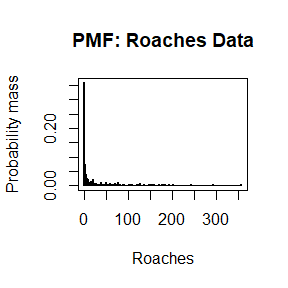
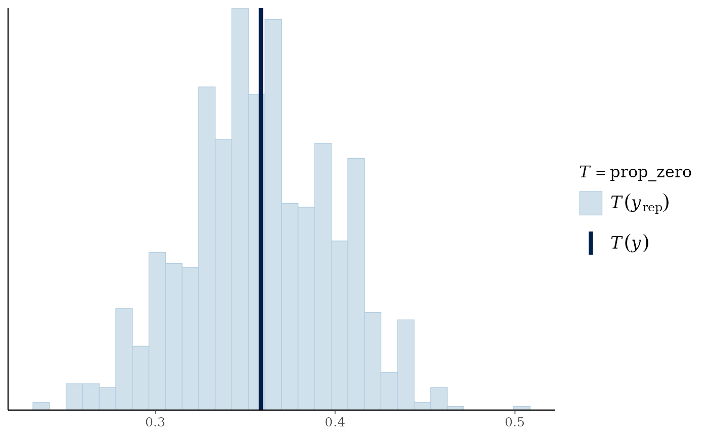
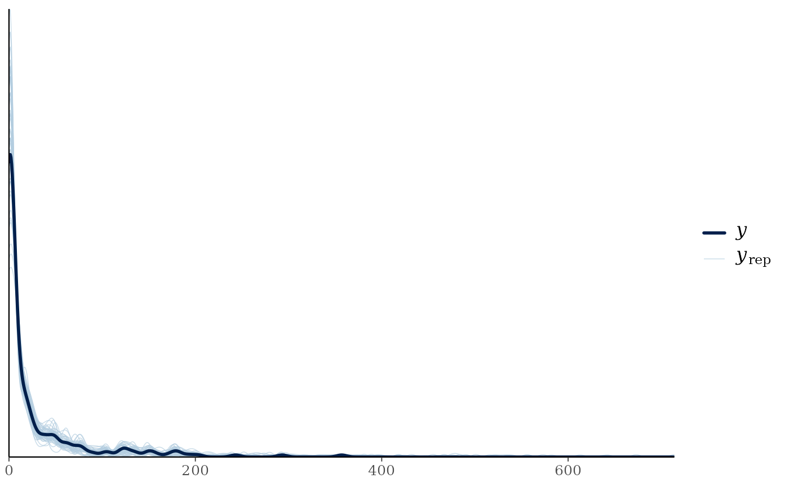
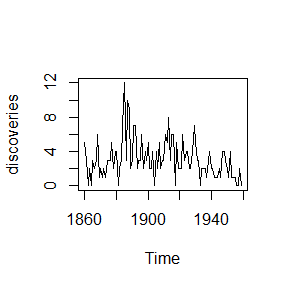
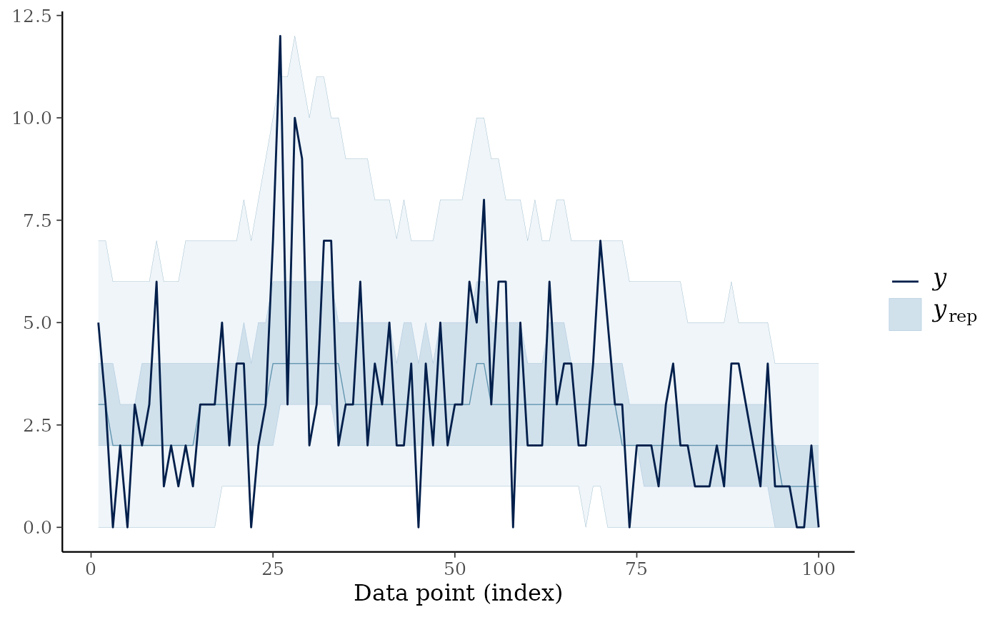

# Getting Started with countSTAR

## Introduction

The `countSTAR` package implements a variety of methods to analyze count
data, all based on Simultaneous Transformation and Rounding (STAR)
models. The package functionality is broadly split into three
categories: frequentist/classical estimation (Kowal and Wu
([2021](#ref-kowal2021semiparametric))), Bayesian modeling and
prediction (Kowal and Canale ([2020](#ref-Kowal2020a)); Kowal and Wu
([2022](#ref-kowalSTARconjugate))), and time series analysis and
forecasting (King and Kowal ([2023](#ref-king2023warped))).

We give a brief description of the STAR framework, before diving into
specific examples that show the `countSTAR` functionality.

## STAR Model Overview

STAR models build upon continuous data models to provide a *valid
count-valued data-generating process*. As a motivating example, consider
the common practice of taking log- or square-root transformations of
count data and then applying continuous data models (e.g., Gaussian or
OLS regressions). This approach is widely popular because it addresses
the skewness often found in count data and enables use of familiar
models, but it does not provide a valid count data distribution. STAR
models retain the core components—the transformation and the continuous
data model—but add in a rounding layer to ensure a coherent,
count-valued data-generating process. For example: $$\begin{aligned}
y_{i} & {= \text{floor}\left( y_{i}^{*} \right)} \\
z_{i} & {= \log\left( y_{i}^{*} \right)} \\
z_{i} & {= x_{i}\prime\theta + \epsilon_{i},\quad\epsilon_{i} \sim N\left( 0,\sigma^{2} \right)}
\end{aligned}$$ The transformation and continuous data model are not
applied directly to the observed counts $y_{i}$, but rather to a latent
“continuous proxy” $y_{i}^{*}$. The (latent) continuous data model is
linked to the (observed) count data via a coarsening operation. This is
*not* the same as rounding the outputs from a fitted continuous data
model: the discrete nature of the data is built into the model itself,
and thus is central in estimation, inference, and prediction.

More generally, STAR models are defined via a *rounding operator* $h$, a
(known or unknown) *transformation* $g$, and a *continuous data model*
with unknown parameters $\theta$: $$\begin{aligned}
y_{i} & {= h\left( y_{i}^{*} \right)\quad\text{(rounding)}} \\
z_{i} & {= g\left( y_{i}^{*} \right)\quad\text{(transformation)}} \\
z_{i} & {= \mu_{\theta}\left( x_{i} \right) + \epsilon_{i}\quad\text{(model)}} \\
 & 
\end{aligned}$$ usually with
$\epsilon_{i} \sim N\left( 0,\sigma^{2} \right)$. Examples of
$\mu_{\theta}(x)$ include linear, additive, and tree-based regression
models. The regression model may be replaced with a time series model
(see
[`warpDLM()`](https://bking124.github.io/countSTAR/reference/warpDLM.md),
discussed below) or other continuous data models.

STAR models are highly flexible models and provide the capability to
model count (or rounded) data with challenging features such as

- zero-inflation
- over- or under-dispersion
- bounded or censored data
- heaping or multi-modality

all with minimal user inputs and within a regression (or time series)
context.

### The Rounding Operator

The rounding operator $h$ is a many-to-one function (or coarsening) that
sets $y = j$ whenever $y^{*} \in A_{j}$ or equivalently when
$z \in g\left( A_{j} \right)$. The floor function
$A_{j}:=\lbrack j,j + 1)$ works well as a default, with modifications
for lower and upper endpoints. First,
$g\left( A_{0} \right):=( - \infty,0)$ ensures that $y = 0$ whenever
$z < 0$. Much of the latent space is mapped to zero, which enables STAR
models to account for zero-inflation. Similarly, when there is a known
(finite) upper bound `y_max` for the data, we fix
$g\left( A_{K} \right):=\lbrack g\left( a_{K} \right),\infty)$, so STAR
models can capture endpoint inflation. In fact, because of the
coarsening nature of STAR models, they equivalently can be applied for
count data that are bounded *or* censored at `y_max` without any
modifications (Kowal and Canale ([2020](#ref-Kowal2020a))). From the
user’s perspective, only `y_max` needs to be specified (if finite).

### The Transformation Function

There are a variety of options for the transformation function $g$,
ranging from fixed functions to data-driven estimates to fully Bayesian
(nonparametric) models for the transformation.

First, all models in `countSTAR` support three fixed transformations:
`log`, `sqrt`, and `identity` (essentially a rounding-only model). In
these cases, the STAR model has exactly the same number of unknown
parameters as the (latent) continuous data model. Thus, it gives a
parsimonious adaptation of continuous data models to the count data
setting.

Second, most functions support a set of transformations that are
estimated by matching marginal moments of the data $y$ to the latent
$z$:

- `transformation='np'` is a nonparametric transformation estimated from
  the empirical CDF of $y$
- `transformation='pois'` uses a moment-matched marginal Poisson CDF
- `transformation='neg-bin'` uses a moment-matched marginal Negative
  Binomial CDF.

Details on the estimation of these transformations can be found in Kowal
and Wu ([2021](#ref-kowal2021semiparametric)). The nonparametric
transformation `np` is effective across a variety of empirical examples,
so it is the default for frequentist STAR methods. The main drawback of
this group of transformations is that, after being estimated, they are
treated as fixed and known for estimation and inference of $\theta$. Of
course, this drawback is limited when $n$ is large.

Finally, Bayesian STAR methods enable joint learning of the
transformation $g$ along with the model parameters $\theta$. Thus,
uncertainty about the transformation is incorporated into all downstream
estimation, inference, and prediction. These include both nonparametric
and parametric transformations:

- `transformation='bnp'`: the transformation is modeled using Bayesian
  nonparametrics, and specifically via a Dirichlet process for the
  marginal outcome distribution, which incorporates uncertainty about
  the transformation into posterior and predictive inference.
- `transformation='box-cox'`: the transformation is assumed to belong to
  the Box-Cox family; the $\lambda$ parameter can be fixed or learned.
- `transformation='ispline'`: the transformation is modeled as an
  unknown, monotone function using I-splines. The Robust Adaptive
  Metropolis (RAM) sampler is used for the unknown transformation $g$.

The transformation `bnp` is the default for all applicable Bayesian
models. It is nonparametric, which provides substantial distributional
flexible for STAR regression, and is remarkably computationally
efficient—even compared to parametric alternatives. This approach is
inspired by Kowal and Wu ([2025](#ref-Kowal03042025)).

For any `countSTAR` function, the user can see which transformations are
supported by checking the appropriate help page, e.g., `?blm_star()`.

## Count-Valued Data: The Roaches Dataset

As an example of challenging count-valued data, consider the `roaches`
data from Gelman and Hill ([2006](#ref-Gelman_Hill_2006)). The response
variable, $y_{i}$, is the number of roaches caught in traps in apartment
$i$, with $i = 1,\ldots,n = 262$.

``` r
data(roaches, package="countSTAR") 

# Roaches:
y = roaches$y

# Plot the PMF:
plot(0:max(y), 
     sapply(0:max(y), function(js) mean(js == y)), 
     type='h', lwd=2, main = 'PMF: Roaches Data',
     xlab = 'Roaches', ylab = 'Probability mass')
```



There are several notable features in the data:

1.  Zero-inflation: 36% of the observations are zeros.
2.  (Right-) Skewness, which is clear from the histogram and common for
    (zero-inflated) count data.
3.  Overdispersion: the sample mean is 26 and the sample variance is
    2585.

A pest management treatment was applied to a subset of 158 apartments,
with the remaining 104 apartments receiving a control. Additional data
are available on the pre-treatment number of roaches, whether the
apartment building is restricted to elderly residents, and the number of
days for which the traps were exposed. We are interested in modeling how
the roach incidence varies with these predictors.

``` r
# Design matrix:
X = model.matrix( ~ roach1 + treatment + senior + log(exposure2),
                 data = roaches)

head(X)
#>   (Intercept) roach1 treatment senior log(exposure2)
#> 1           1 308.00         1      0     -0.2231436
#> 2           1 331.25         1      0     -0.5108256
#> 3           1   1.67         1      0      0.0000000
#> 4           1   3.00         1      0      0.0000000
#> 5           1   2.00         1      0      0.1335314
#> 6           1   0.00         1      0      0.0000000
```

## Frequentist inference for STAR models

Frequentist (or classical) estimation and inference for STAR models is
provided by an EM algorithm. Sufficient for estimation is an `estimator`
function which solves the least squares (or Gaussian maximum likelihood)
problem associated with $\mu_{\theta}$—or in other words, the estimator
that *would* be used for Gaussian or continuous data. Specifically,
`estimator` inputs data and outputs a list with two elements: the
estimated `coefficients` $\widehat{\theta}$ and the `fitted.values`
${\widehat{\mu}}_{\theta}\left( x_{i} \right) = \mu_{\widehat{\theta}}\left( x_{i} \right)$.
`countSTAR` includes implementations for linear, random forest, and
generalized boosting regression models (see below), but it is
straightforward to incorporate other models via the generic
[`genEM_star()`](https://bking124.github.io/countSTAR/reference/genEM_star.md)
function.

### The STAR Linear Model

For many cases, the STAR linear model is the first method to try: it
combines a rounding operator $h$, a transformation $g$, and the latent
linear regression model $$\begin{aligned}
z_{i} & {= x_{i}\prime\theta + \epsilon_{i},\quad\epsilon_{i} \sim N\left( 0,\sigma^{2} \right)}
\end{aligned}$$ In `countSTAR`, the (frequentist) STAR linear model is
implemented with
[`lm_star()`](https://bking124.github.io/countSTAR/reference/lm_star.md)
(see
[`blm_star()`](https://bking124.github.io/countSTAR/reference/blm_star.md)
for a Bayesian version).
[`lm_star()`](https://bking124.github.io/countSTAR/reference/lm_star.md)
aims to mimic the functionality of `lm` by allowing users to input a
formula. Standard functions like `coef` and `fitted` can be used on the
output to extract coefficients and fitted values, respectively.

``` r
library(countSTAR)

# EM algorithm for STAR linear regression
fit = lm_star(y ~ roach1 + treatment + senior + log(exposure2),
              data = roaches, 
              transformation = 'np')

# Fitted coefficients:
round(coef(fit), 3)
#>    (Intercept)         roach1      treatment         senior log(exposure2) 
#>          0.035          0.006         -0.285         -0.321          0.216
```

Here the frequentist nonparametric transformation was used, but other
options are available; see `?lm_star()` for details.

Based on the fitted STAR linear model, we may further obtain *confidence
intervals* for the estimated coefficients using
[`confint()`](https://rdrr.io/r/stats/confint.html):

``` r
# Confidence interval for all coefficients
confint(fit)
#>                       2.5 %       97.5 %
#> (Intercept)    -0.139711518  0.199942615
#> roach1          0.004898573  0.007468304
#> treatment      -0.488199761 -0.085641963
#> senior         -0.548729134 -0.102510551
#> log(exposure2) -0.197843036  0.636935236
```

Similarly, *p-values* are available using likelihood ratio tests, which
can be applied for individual coefficients,

$$H_{0}:\theta_{j} = 0\quad\text{vs.}\quad H_{1}:\theta_{j} \neq 0$$

or for joint sets of variables, analogous to a (partial) F-test:

$$H_{0}:\theta_{1} = \ldots = \theta_{p} = 0\quad\text{vs.}\quad H_{1}:\theta_{j} \neq 0{\mspace{6mu}\text{for some}\mspace{6mu}}j = 1,\ldots,p$$
P-values for all individual coefficients as well as the p-value for
*any* effects are computed with the
[`pvals()`](https://bking124.github.io/countSTAR/reference/pvals.md)
function.

``` r
# P-values:
round(pvals(fit), 4)
#>        (Intercept)             roach1          treatment             senior 
#>             0.6973             0.0000             0.0056             0.0049 
#>     log(exposure2) Any linear effects 
#>             0.3072             0.0000
```

Finally, we can get predictions at new data points (or the training
data) using [`predict()`](https://rdrr.io/r/stats/predict.html).

``` r
#Compute the predictive draws (just using observed points here)
y_pred = predict(fit)
```

For predictive distributions,
[`blm_star()`](https://bking124.github.io/countSTAR/reference/blm_star.md)
and other Bayesian models are recommended.

### STAR Machine Learning Models

`countSTAR` also includes STAR versions of machine learning models:
random forests
([`randomForest_star()`](https://bking124.github.io/countSTAR/reference/randomForest_star.md))
and generalized boosted machines
([`gbm_star()`](https://bking124.github.io/countSTAR/reference/gbm_star.md)).
These refer to the specification of the latent regression function
$\mu_{\theta}(x)$ along with the accompanying estimation algorithm for
continuous data. Here, the user directly inputs the set of predictors
$X$ alongside any test points in $X_{test}$, excluding the intercept:

``` r
#Fit STAR with random forests
suppressMessages(library(randomForest))
fit_rf = randomForest_star(y = y, X = X[,-1], # no intercept 
                           transformation = 'np')

#Fit STAR with GBM
suppressMessages(library(gbm))
fit_gbm = gbm_star(y = y, X = X[,-1], # no intercept 
                   transformation = 'np')
```

For all frequentist models, the functions output log-likelihood values
at the MLEs, which allows for a quick comparison of model fit.

``` r
#Look at -2*log-likelihood
-2*c(fit_rf$logLik, fit_gbm$logLik)
#> [1] 1666.783 1593.495
```

In general, it is preferable to compare these fits using out-of-sample
predictive performance. Point predictions are available via the named
components `fitted.values` or `fitted.values.test` for in-sample
predictions at $X$ or out-of-sample predictions at $X_{test}$,
respectively.

## Bayesian inference for STAR models

Bayesian STAR models only require an algorithm for (initializing and)
sampling from the posterior distribution under a *continuous data
model*. In particular, the most convenient strategy for posterior
inference with STAR is to use a data-augmentation Gibbs sampler, which
combines that continuous data model sampler with a draw from the latent
data posterior, $\left\lbrack z|y,\theta \right\rbrack$, which is a
truncated (Gaussian) distribution. For special cases of Bayesian STAR
models, direct Monte Carlo (not MCMC) sampling is available.

Efficient algorithms are implemented for several popular Bayesian
regression and time series models (see below). The user may also adapt
their own continuous data models and algorithms to the count data
setting via the generic function
[`genMCMC_star()`](https://bking124.github.io/countSTAR/reference/genMCMC_star.md).

### Bayesian STAR Linear Model

Revisiting the STAR linear model, the Bayesian version places a prior on
$\theta$. The default in `countSTAR` is Zellner’s g-prior, which has the
most functionality, but other options are available (namely, horseshoe
and ridge priors). The model is estimated using
[`blm_star()`](https://bking124.github.io/countSTAR/reference/blm_star.md).
Note that for the Bayesian models in `countSTAR`, the user must supply
the design matrix $X$ (and if predictions are desired, a matrix of
predictors at the test points). We apply this to the roaches data, now
using the default Bayesian nonparametric transformation:

``` r
fit_blm = blm_star(y = y, X = X, 
                   transformation = 'bnp')
```

In some cases, direct Monte Carlo (not MCMC) sampling can be performed
(see Kowal and Wu ([2022](#ref-kowalSTARconjugate)) for details): simply
set `use_MCMC=FALSE`. Although it is appealing to avoid MCMC, the output
is typically similar and the Monte Carlo sampler requires truncated
*multivariate* normal draws, which become slow for large $n$.

Posterior expectations and posterior credible intervals from the model
are available as follows:

``` r
# Posterior mean of each coefficient:
round(coef(fit_blm),3)
#>    (Intercept)         roach1      treatment         senior log(exposure2) 
#>          0.316          0.008         -0.388         -0.420          0.284

# Credible intervals for regression coefficients
ci_all_bayes = apply(fit_blm$post.beta,
      2, function(x) quantile(x, c(.025, .975)))

# Rename and print:
rownames(ci_all_bayes) = c('Lower', 'Upper')
print(t(round(ci_all_bayes, 3)))
#>                 Lower  Upper
#> (Intercept)     0.020  0.605
#> roach1          0.006  0.010
#> treatment      -0.648 -0.122
#> senior         -0.717 -0.127
#> log(exposure2) -0.220  0.831
```

We can check standard MCMC diagnostics:

``` r
# MCMC diagnostics for posterior draws of the regression coefficients (excluding intercept)
plot(as.ts(fit_blm$post.beta[,-1]), 
     main = 'Trace plots', cex.lab = .75)
```


``` r

# (Summary of) effective sample sizes (excluding intercept)
suppressMessages(library(coda))
getEffSize(fit_blm$post.beta[,-1])
#>    Min. 1st Qu.  Median    Mean 3rd Qu.    Max. 
#>   676.2   736.1   759.6   798.8   822.3  1000.0
```

We may further evaluate the model based on posterior diagnostics and
posterior predictive checks on the simulated versus observed proportion
of zeros. Posterior predictive checks are easily visualized using the
[bayesplot](https://mc-stan.org/bayesplot/index.html) package.

``` r
# Posterior predictive check using bayesplot
suppressMessages(library(bayesplot))
prop_zero = function(y) mean(y == 0)
ppc_stat(y = y, 
          yrep = fit_blm$post.pred, 
          stat = "prop_zero")
```



### BART STAR

One of the most flexible model options is to use Bayesian Additive
Regression Trees (BART; Chipman, George, and McCulloch
([2012](#ref-chipman2010bart))) as the latent regression model. Here,
$\mu_{\theta}(x)$ is a sum of many shallow trees with small (absolute)
terminal node values. BART-STAR enables application of BART models and
algorithms for count data, thus combining the *regression* flexibility
of BART with the (marginal) *distributional* flexibility of STAR:

``` r
fit_bart = bart_star(y = y, X = X, 
                     transformation = 'np')
#> [1] "1 sec remaining"
#> [1] "Total time: 2 seconds"
```

Since `bnp` is not yet implemented for
[`bart_star()`](https://bking124.github.io/countSTAR/reference/bart_star.md),
we use `np` here. The transformation is still estimated
nonparametrically, but then is treated as fixed and known (see
`'ispline'` for a fully Bayesian and nonparametric version, albeit
slower).

Once again, we can perform posterior predictive checks. This time we
plot the densities:

``` r
ppc_dens_overlay(y = y, 
                 yrep = fit_bart$post.pred[1:50,])
```



Pointwise log-likelihoods and WAIC values are outputted for model
comparison. Using this information, we can see the BART STAR model seems
to have a better fit than the linear model:

``` r
waic <- c(fit_blm$WAIC, fit_bart$WAIC)
names(waic) <- c("STAR Linear Model", "BART-STAR")
print(waic)
#> STAR Linear Model         BART-STAR 
#>          1762.281          1639.514
```

### Other Bayesian Models

To estimate a nonlinear relationship between a (univariate) covariate
$x$ and count-valued $y$,
[`spline_star()`](https://bking124.github.io/countSTAR/reference/spline_star.md)
implements a highly efficient, fully Bayesian spline regression model.

For multiple nonlinear effects,
[`bam_star()`](https://bking124.github.io/countSTAR/reference/bam_star.md)
implements a Bayesian additive model with STAR. The user specifies which
covariates should be modeled linearly and which should be modeled
nonlinearly via splines. Note that
[`bam_star()`](https://bking124.github.io/countSTAR/reference/bam_star.md)
can be slower than
[`blm_star()`](https://bking124.github.io/countSTAR/reference/blm_star.md)
or
[`bart_star()`](https://bking124.github.io/countSTAR/reference/bart_star.md).

## Count Time Series Modeling: warpDLM

Up to this point, we have focused on static regression where the data
does not depend on time. Notably, King and Kowal
([2023](#ref-king2023warped)) extended STAR to the time series setting
by incorporating a powerful time series framework known as Dynamic
Linear Models (DLMs). A DLM is defined by two equations: (i) the
observation equation, which specifies how the observations are related
to the latent state vector and (ii) the state evolution equation, which
describes how the states are updated in a Markovian fashion. More
concretely, and using $t$ subscripts for time: $$\begin{aligned}
z_{t} & {= F_{t}\theta_{t} + v_{t},\quad v_{t} \sim N_{n}\left( 0,V_{t} \right)} \\
\theta_{t} & {= G_{t}\theta_{t - 1} + w_{t},\quad w_{t} \sim N_{p}\left( 0,W_{t} \right)}
\end{aligned}$$ for $t = 1,\ldots,T$, where
$\{ v_{t},w_{t}\}_{t = 1}^{T}$ are mutually independent and
$\theta_{0} \sim N_{p}\left( a_{0},R_{0} \right)$.

Of course, given the Gaussian assumptions of the model, a DLM alone is
not appropriate for count data. Thus, a warping operation—combining the
transformation and rounding—is merged with the DLM, resulting in a
*warped DLM* (warpDLM): $$\begin{aligned}
y_{t} & {= h \circ g^{- 1}\left( z_{t} \right)} \\
{\{ z_{t}\}_{t = 1}^{T}} & {\sim \text{DLM}}
\end{aligned}$$

The DLM form shown earlier is very general. Among these DLMs,
`countSTAR` currently implements the local level model and the local
linear trend model. A local level model (also known as a random walk
with noise model) has a univariate state $\theta_{t}:=\mu_{t}$ with
$$\begin{aligned}
z_{t} & {= \mu_{t} + v_{t},\quad v_{t} \sim N(0,V)} \\
\mu_{t} & {= \mu_{t - 1} + w_{t},\quad w_{t} \sim N(0,W)}
\end{aligned}$$ The local linear trend model extends the local level
model by incorporating a time varying drift $\nu_{t}$ in the dynamics:
$$\begin{aligned}
z_{t} & {= \mu_{t} + v_{t},\quad v_{t} \sim N(0,V)} \\
\mu_{t} & {= \mu_{t - 1} + \nu_{t - 1} + w_{\mu,t},\quad w_{\mu,t} \sim N\left( 0,W_{\mu} \right)} \\
\nu_{t} & {= \nu_{t - 1} + w_{\nu,t},\quad w_{\nu,t} \sim N\left( 0,W_{\nu} \right)}
\end{aligned}$$ This can in turn be recast into the general two-equation
DLM form. Namely, if we let
$\theta_{t}:=\left( \mu_{t},\nu_{t} \right)$, the local linear trend is
written as $$\begin{aligned}
z_{t} & {= \begin{pmatrix}
1 & 0
\end{pmatrix}\begin{pmatrix}
\mu_{t} \\
\nu_{t}
\end{pmatrix} + v_{t},\quad v_{t} \sim N(0,V)} \\
\begin{pmatrix}
\mu_{t} \\
\nu_{t}
\end{pmatrix} & {= \begin{bmatrix}
1 & 1 \\
0 & 1
\end{bmatrix}\begin{pmatrix}
\mu_{t - 1} \\
\nu_{t - 1}
\end{pmatrix} + \mathbf{w}_{\mathbf{t}},\quad\mathbf{w}_{\mathbf{t}} \sim N\begin{pmatrix}
{\mathbf{0},\begin{bmatrix}
W_{\mu} & 0 \\
0 & W_{\nu}
\end{bmatrix}}
\end{pmatrix}}
\end{aligned}$$

These two common forms have a long history and are also referred to as
structural time series models (implemented in base R via
[`StructTS()`](https://rdrr.io/r/stats/StructTS.html)). With
`countSTAR`, warpDLM time series modeling is accomplished via the
[`warpDLM()`](https://bking124.github.io/countSTAR/reference/warpDLM.md)
function. In the below, we apply the model to a time series dataset
included in base R concerning yearly numbers of important discoveries
from 1860 to 1959
([`?discoveries`](https://rdrr.io/r/datasets/discoveries.html) for more
information).

``` r
#Visualize the data
plot(discoveries)
```



``` r

# Required package:
library(KFAS)
#> Please cite KFAS in publications by using: 
#> 
#>   Jouni Helske (2017). KFAS: Exponential Family State Space Models in R. Journal of Statistical Software, 78(10), 1-39. doi:10.18637/jss.v078.i10.

#Fit the model
warpfit = warpDLM(y = discoveries, type = "trend")
#> [1] "Time taken:  31.846  seconds"
```

Once again, we can check fit using posterior predictive checks. The
median of the posterior predictive draws can act as a sort of
count-valued smoother of the time series.

``` r
ppc_ribbon(y = as.vector(discoveries), 
           yrep = warpfit$post_pred)
```



## References

Chipman, Hugh A., Edward I. George, and Robert E. McCulloch. 2012.
“BART: Bayesian additive regression trees.” *Annals of Applied
Statistics* 6 (1): 266–98. <https://doi.org/10.1214/09-AOAS285>.

Gelman, Andrew, and Jennifer Hill. 2006. *Data Analysis Using Regression
and Multilevel/Hierarchical Models*. Cambridge University Press.

King, Brian, and Daniel R. Kowal. 2023. “Warped Dynamic Linear Models
for Time Series of Counts.” *Bayesian Analysis*, 1–26.
<https://doi.org/10.1214/23-BA1394>.

Kowal, Daniel R., and Antonio Canale. 2020. “Simultaneous Transformation
and Rounding (STAR) Models for Integer-Valued Data.” *Electronic Journal
of Statistics* 14 (1). <https://doi.org/10.1214/20-ejs1707>.

Kowal, Daniel R., and Bohan Wu. 2021. “Semiparametric Count Data
Regression for Self-Reported Mental Health.” *Biometrics*.
<https://onlinelibrary.wiley.com/doi/10.1111/biom.13617>.

———. 2022. “Semiparametric Discrete Data Regression with Monte Carlo
Inference and Prediction.” <https://arxiv.org/abs/2110.12316>.

———. 2025. “Monte Carlo Inference for Semiparametric Bayesian
Regression.” *Journal of the American Statistical Association* 120
(550): 1063–76. <https://doi.org/10.1080/01621459.2024.2395586>.
